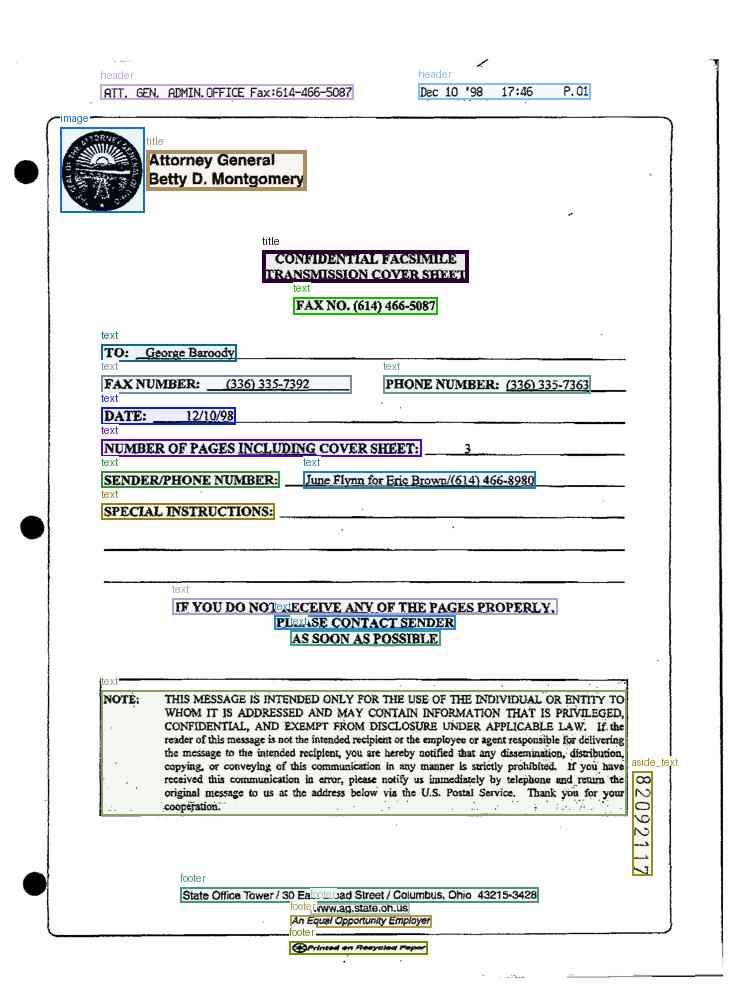
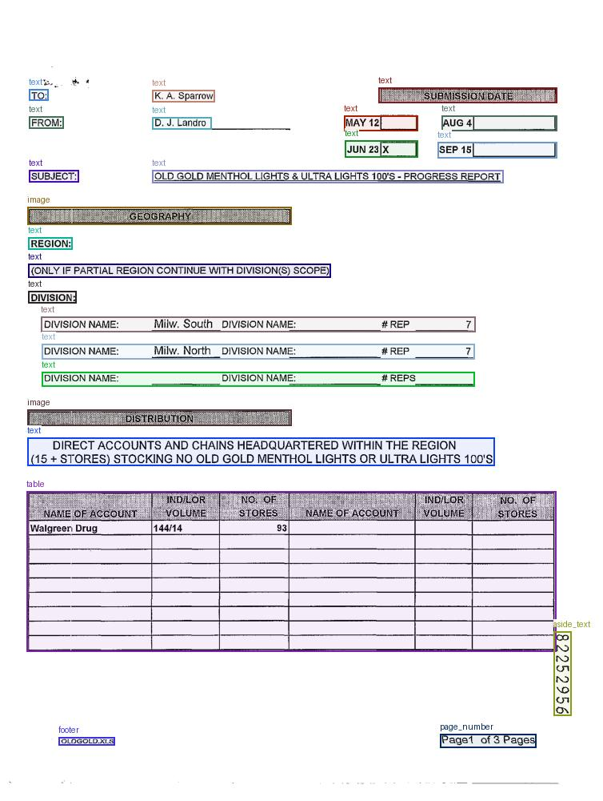
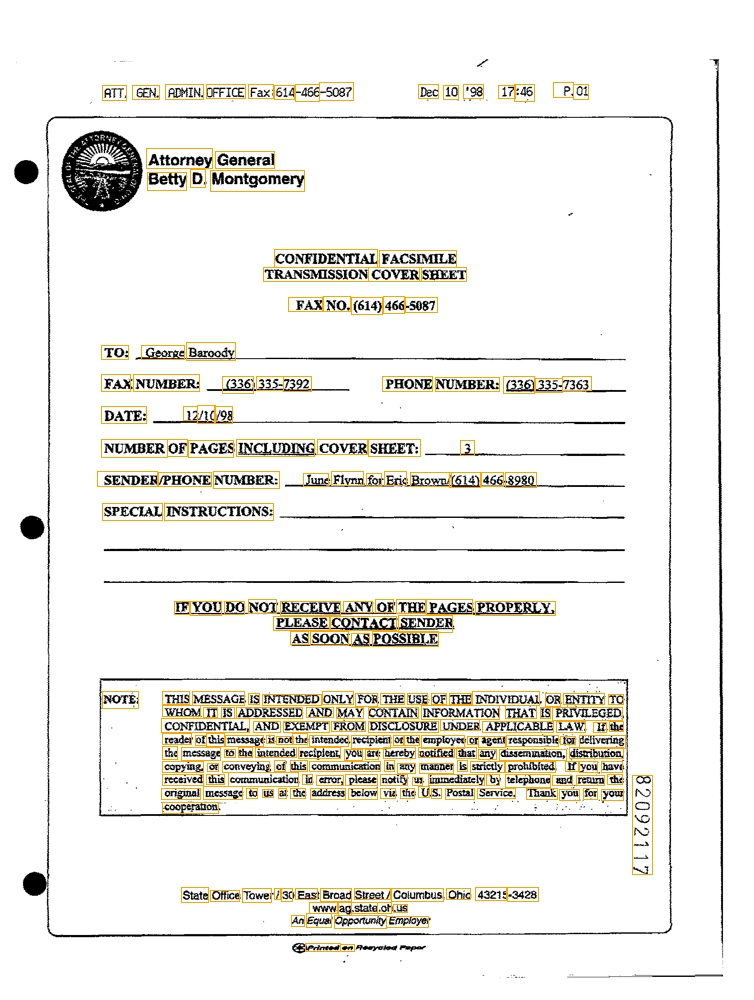
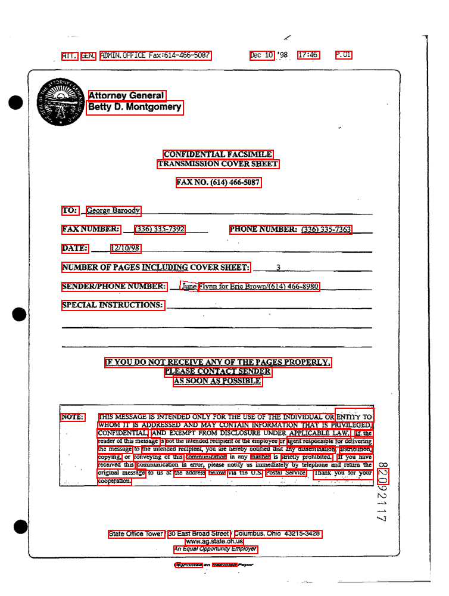
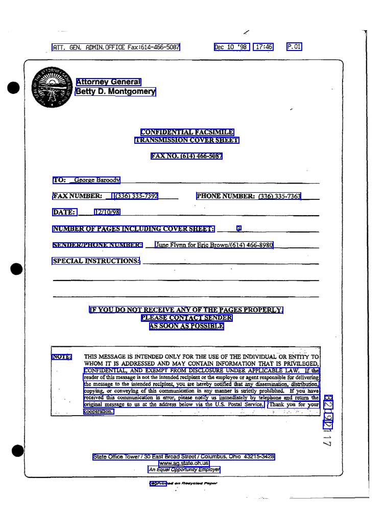

# Unlimited-OCR Benchmark

[baidu/Unlimited-OCR](https://huggingface.co/baidu/Unlimited-OCR) (3B MoE) 모델을 PaddleOCR, EasyOCR과 동일 조건에서 비교 실험한 벤치마크 프로젝트.

## 핵심 발견

**Unlimited-OCR는 텍스트를 정확하게 읽는 것은 물론, 문서 구조 자체를 이해한다.**

기존 OCR(PaddleOCR, EasyOCR)은 "어디에 글자가 있는지 찾고 → 읽는" 2단계 파이프라인이다. Unlimited-OCR는 여기서 한 단계 더 나아가 문서의 **의미 구조**(header, text, table, footer, image 등)까지 자동 분류하고, 테이블은 HTML로 구조화하여 출력한다.

### Unlimited-OCR가 실제로 하는 일





- `header`, `title`, `text`, `table`, `footer`, `image`, `page_number`, `aside_text` 등 **의미 기반 영역 자동 분류**
- 테이블 → HTML `<table>` **구조화 변환**
- 이미지 영역 → 마크다운 이미지 링크 자동 치환
- 읽기 어려운 영역 자동 감지 및 표시

텍스트 자체의 인식 정확도도 높다. 깨끗한 타이핑 문서에서 CER 1~6% 수준으로, 기존 OCR과 동등하거나 그 이상이다.

### 기존 OCR과의 BBox 비교

동일한 FUNSD 서류에서 각 모델이 탐지하는 영역의 차이.

| GT (정답 — 단어 단위) | EasyOCR (단어/구 단위) | PaddleOCR (라인 단위) |
|---|---|---|
|  |  |  |

기존 OCR은 텍스트 위치만 찾는다. Unlimited-OCR는 **"이건 헤더다", "이건 표다", "이건 푸터다"**까지 분류한다.

## 활용 가능성

3B 파라미터(500M 활성)로 가볍고, 40페이지 이상 문서도 한 번에 처리 가능하다(R-SWA 메커니즘). 후처리만 잘 붙이면 바로 업무 자동화에 쓸 수 있다.

| 활용 분야 | 방법 |
|-----------|------|
| **영수증/인보이스** | 테이블 → HTML 파싱으로 품목·금액 자동 추출 |
| **보험/병원 청구서** | 양식 필드명(DATE, SENDER 등)과 작성 값 구분 추출 |
| **계약서/법률문서** | header·본문·서명란 자동 분류, 수십 페이지 일괄 처리 |
| **물류/세관 서류** | 구조화된 표 데이터 추출, 누락 항목 자동 감지 |
| **PDF 디지털화** | 전체 문서를 마크다운으로 한 번에 변환 |

## 벤치마크 수치

FUNSD 데이터셋 50장(스캔 서류 전체 페이지, 754×1000, 필기+인쇄 혼합)에서 측정.

| | PaddleOCR | EasyOCR | Unlimited-OCR |
|---|---|---|---|
| Mean CER | **0.169** | 0.253 | 0.486 |
| Mean WER | 0.472 | 0.617 | **0.426** |
| Inference Time / page | 1.33s | **0.87s** | 20.9s |

**WER(단어 오류율)은 Unlimited-OCR가 가장 낮다.** 단어 자체는 가장 정확하게 읽는다.

CER이 높게 나오는 이유는 모델이 잘못 읽어서가 아니라, HTML 테이블 태그·마크다운 등 **구조화 포맷팅이 추가**되기 때문이다. 기존 OCR은 plain text만 출력하지만, Unlimited-OCR는 문서 구조를 담은 리치 텍스트를 출력하므로 단순 문자열 비교 메트릭(CER)으로는 이 모델의 성능을 정확히 반영할 수 없다.

단순 텍스트 추출 속도가 중요하면 PaddleOCR, 문서 구조까지 필요하면 Unlimited-OCR.

## Setup

```bash
python -m venv .venv && .venv\Scripts\activate
pip install torch torchvision --index-url https://download.pytorch.org/whl/cu124
pip install -r requirements.txt
```

## Usage

```bash
# 전체 벤치마크 (3 models × FUNSD)
python -m benchmark

# 특정 모델만
python -m benchmark -m unlimited_ocr -d funsd

# 샘플 수 제한 + 상세 로그
python -m benchmark -m easyocr paddleocr -d funsd -n 10 -v
```

결과는 `outputs/results/<timestamp>/`에 저장. Unlimited-OCR의 BBox 이미지와 파싱 결과는 `unlimited_ocr_visuals/` 하위 폴더.

## Project Structure

```
benchmark/
├── datasets/       # FUNSD 로더 (reading-order reconstruction)
├── models/         # OCR 모델 러너 (공통 인터페이스)
├── evaluation/     # CER, WER, 텍스트 정규화
├── results/        # CSV/JSON export + 콘솔 리포터
├── pipeline.py     # 오케스트레이터
└── cli.py          # CLI
```

## Models

| Model | Type | Parameters | GPU |
|-------|------|-----------|-----|
| [Unlimited-OCR](https://huggingface.co/baidu/Unlimited-OCR) | MoE VLM (BF16) | 3B total / 500M active | Required |
| [PaddleOCR](https://github.com/PaddlePaddle/PaddleOCR) | Det + Rec | - | Optional |
| [EasyOCR](https://github.com/JaidedAI/EasyOCR) | Det + Rec | - | Optional |

## References

- [Unlimited OCR Works (arXiv:2606.23050)](https://arxiv.org/abs/2606.23050)
- [baidu/Unlimited-OCR (HuggingFace)](https://huggingface.co/baidu/Unlimited-OCR)
- [FUNSD Dataset](https://guillaumejaume.github.io/FUNSD/)
